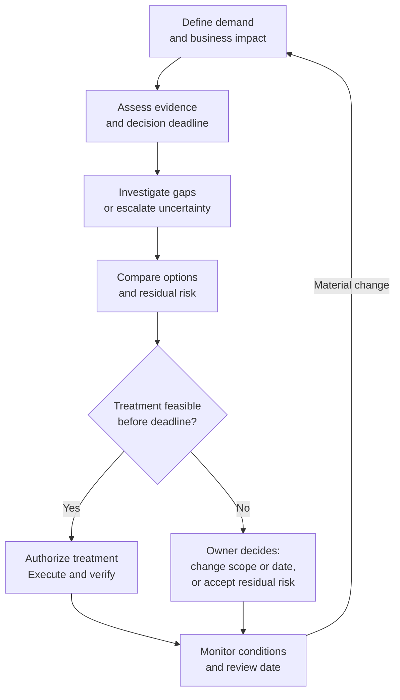

# Capacity risk management

This page explains how Capacity Operations (CapOps) turns capacity uncertainty into an owned business decision. Use it to connect technical evidence, feasible responses, and the deadline after which useful options disappear.

## Definition

Capacity risk management identifies, assesses, treats, accepts, monitors, and revisits uncertainty that could prevent a workload from deploying, scaling, operating, or recovering as required.

## Purpose

Give the authorized risk owner enough context to choose a response before the affected business milestone or recovery obligation is compromised.

## Why it matters

“Capacity may be unavailable” is too broad to act on. A decision-ready statement links **a specific resource dependency → a possible unmet quantity or date → a service or delivery consequence → business impact**. The record must distinguish uncertainty, confirmed shortfall, and an active incident; these require different actions.

## Desired outcomes

- Material exposures have specific dimensions, business owners, and decision deadlines.
- Options state implementation time, cost, constraints, and remaining risk.
- Accepted risks have authority, rationale, expiry or review dates, and triggers.
- Evidence gaps and correlated portfolio exposures remain visible.

## Inputs

- Workload criticality, milestones, recovery objectives, and business impact.
- Forecast scenarios, location and family dependencies, and qualified alternatives.
- Limit, mechanism, deployment, and exercise evidence with timestamps.
- Commercial obligations, switching lead times, and delegated risk authority.
- Existing incidents, accepted risks, and organizational risk assessment criteria.

## Activities

1. Write a scoped risk statement: “If [specific condition], then [resource/date requirement] may not be met, affecting [business outcome].”
2. Record evidence and its limitations. Do not invent a numerical failure probability when available observations cannot support it.
3. Assess impact and likelihood or uncertainty using the organization's criteria. Record correlation with other workloads sharing families, destinations, or dependencies.
4. Define the latest decision date from the time needed to prepare and execute alternatives, including approvals and validation. Give evidence-gathering actions earlier deadlines.
5. Compare treatment options: change placement, modernize, stage or reduce demand, acquire a supported mechanism, protect allocations, change the date, or accept residual risk.
6. Obtain a decision from the authorized business risk owner, with technical and commercial approvals where needed. Assign treatment actions and evidence for closure.
7. Monitor triggers, expiry, and outcomes. Reopen a closed or accepted record when assumptions materially change.

The decision flow separates evidence review from response selection. Investigate gaps within the available decision window. If evidence remains insufficient or time is too short, escalate the uncertainty to the authorized risk owner before choosing a response; it must not silently become an accepted risk.

Risk acceptance does not create capacity. Verification can close an action while leaving residual exposure open; record the distinction.

## Outputs

- A capacity-risk register with demand dimensions, evidence, impact, and ownership.
- Decision records comparing feasible options and their deadlines.
- Treatment actions with completion evidence and residual-risk status.
- Escalations for expired options, overdue decisions, and correlated portfolio exposure.

## Roles involved

The business or service risk owner accepts business exposure within delegated authority; an executive resolves risks beyond that authority. Architects, engineering, operations, and continuity owners assess technical and recovery consequences. FinOps and procurement evaluate economic and contractual options. The CapOps practitioner maintains traceability and review discipline, but does not universally own risk acceptance.

## Dependencies on other capabilities

- [Capacity visibility](capacity-visibility.md) supplies facts and evidence-quality gaps.
- [Capacity forecasting](capacity-forecasting.md) identifies future shortfall scenarios.
- [Workload placement](workload-placement.md) supplies qualified alternatives and switching time.
- [Capacity acquisition](capacity-acquisition.md) supplies supported mechanisms and their exclusions.
- [Capacity governance](capacity-governance.md) establishes authority, escalation, and exception expiry.

## Suggested measurements

Targets, materiality, and risk categories are **organization-defined**. Show critical records individually alongside aggregates.

| Measure | Definition | Limitation |
|---|---|---|
| Decision-ready risk share | Open material risks with impact, current evidence, options, risk owner, action owner, and deadline / all open material risks × 100 | Completeness does not validate the assessment or show undiscovered risks |
| Overdue decision share | Open risks past their decision deadline / all open risks requiring a decision at the snapshot × 100 | Undefined for an empty denominator; publish count and affected milestones |
| Treatment verification timeliness | Treatment actions verified by their agreed deadline / all treatment actions due in the period × 100 | Action completion is not risk elimination; separately state residual exposure and pending tests |

## Maturity indicators

- **Reactive:** Risks are raised as urgent escalations after delivery is already affected.
- **Aware:** Teams list important constraints but omit consistent ownership, evidence, or decision dates.
- **Managed:** Material risks have authorized owners, comparable options, deadlines, treatments, and review triggers.
- **Optimized:** Correlated exposure, expired alternatives, and treatment evidence are reviewed across workloads.
- **Strategic:** Portfolio priorities and architecture investments explicitly account for capacity uncertainty and accepted business exposure.

## Practical example

A fictional migration needs a specialized family in an approved location. The forecast is complete and quota is approved, but no matching capacity mechanism or full-quantity deployment evidence exists. An alternative family needs four weeks of qualification. The risk decision therefore falls before that preparation window, not on migration day. The business owner authorizes qualification and a staged fallback; uncertainty about the preferred family remains visible.

## Risks and common mistakes

- Reporting a red status without an actionable decision.
- Equating unknown physical supply with confirmed unavailability.
- Closing exposure because quota was approved or a forecast was acknowledged.
- Using a weighted portfolio average to hide a critical recovery gap.
- Accepting risk without authority, expiry, or a viable response to changed conditions.

## Related content

- [Understand capacity domain](../domains/understand-capacity.md)
- [Capacity resilience](capacity-resilience.md)
- [Reporting and key performance indicators](reporting-and-kpis.md)
- [Personas and accountability](../framework/personas.md)
