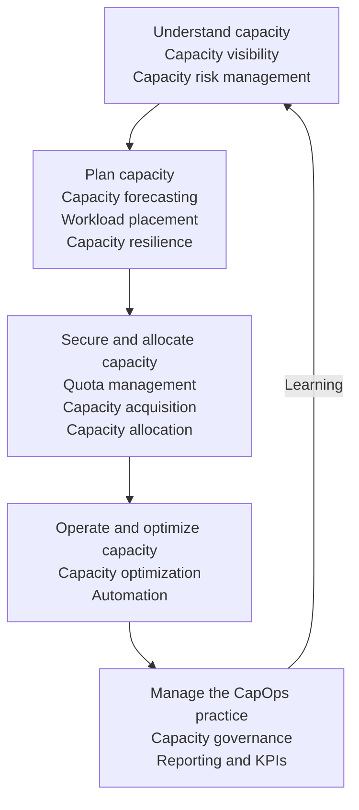

# CapOps domains

This page groups Capacity Operations (CapOps) work into five domains. Domains describe outcomes; capabilities describe the repeatable work used to achieve them. The grouping is a navigation aid rather than an organizational chart.

| Domain | Business outcome | Primary capabilities |
|---|---|---|
| [Understand capacity](../domains/understand-capacity.md) | Decision-makers can distinguish facts, uncertainty, and business exposure | Capacity visibility; capacity risk management |
| [Plan capacity](../domains/plan-capacity.md) | Business plans have dimensioned demand and feasible alternatives | Capacity forecasting; workload placement; capacity resilience |
| [Secure and allocate capacity](../domains/secure-and-allocate-capacity.md) | Prioritized demand has an owned capacity path and stated residual risk | Quota management; capacity acquisition; capacity allocation |
| [Operate and optimize capacity](../domains/operate-and-optimize-capacity.md) | Capacity stays useful as usage and obligations change | Capacity optimization; automation |
| [Manage the CapOps practice](../domains/manage-the-capops-practice.md) | Decision rights, evidence standards, reporting, and improvement remain effective | Capacity governance; reporting and key performance indicators (KPIs) |

## How the capabilities connect

The diagram lists each of the twelve capabilities within its primary domain and shows a domain-level flow. The table above provides the detailed mapping. These are not exclusive boundaries or sequential approval gates: governance and reporting span every domain, and resilience is revisited during operation.

For example, visibility supplies a baseline to forecasting; placement turns forecast demand into feasible configurations; acquisition and allocation establish a capacity path; optimization returns changes to the forecast. Risk management and governance ensure unresolved exposure reaches an authorized decision-maker.

## Apply domains to a real decision

Choose a business milestone, then identify the outputs needed from each relevant domain. A launch may need a forecast from Plan capacity, a mechanism and allocation from Secure and allocate capacity, and a release or renewal trigger from Operate and optimize capacity. Manage the CapOps practice defines who approves these choices and how exceptions expire.

Name handoff owners and link the evidence. A domain is not “complete” while its output cannot be used by the next decision. A placement choice without timing, quantity, and dependency constraints is not sufficient input to acquisition.

## Risks and common mistakes

- Turning the five domains into five sequential approval queues.
- Inventing extra canonical capabilities for activities such as profiling or scenario planning; these are activities within the catalog.
- Treating resilience as belonging only to continuity teams or governance as belonging only to a central lead.
- Hiding unknown capacity conditions behind an aggregate domain status.

## Related content

- [Framework overview](framework-overview.md)
- [Capability catalog](capabilities.md)
- [Lifecycle](lifecycle.md)
- [Operating model](../operating-model/operating-model.md)
