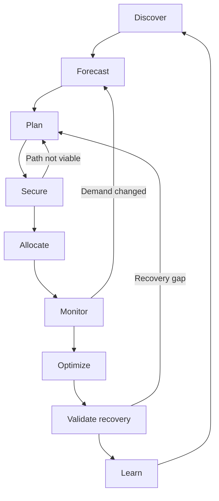

# The CapOps lifecycle

This page describes the nine-stage Capacity Operations (CapOps) lifecycle and the evidence that connects its stages. Use it to coordinate decisions from demand discovery through operation and recovery learning.

## A continuous loop with multiple re-entry points

The lifecycle is **Discover → Forecast → Plan → Secure → Allocate → Monitor → Optimize → Validate recovery → Learn**.

The diagram shows the full loop and selected feedback paths. Teams may work on several stages at once; a material change returns affected work to the appropriate stage rather than forcing every record through the entire sequence.

A launch-date change can reopen Forecast; a rejected mechanism can reopen Plan; a portfolio recovery conflict can reopen both Plan and Allocate. Recovery validation is not postponed until all optimization work finishes. Critical assumptions should be examined during design and exercised at agreed readiness checkpoints.

## Stage actions, evidence, and re-entry

| Stage | Evidence to bring | Action and decision | Evidence to retain | Re-enter when |
|---|---|---|---|---|
| **Discover** | Business milestones, workload inventory, dependency map, actual usage | Identify consumers, criticality, constraints, missing evidence, and review scope | Owned workload profiles and discovery gaps | New workloads, dependencies, or business obligations appear |
| **Forecast** | Baseline, business drivers, performance tests, migration and retirement plans | Translate demand into technical ranges across near-term, medium-term, and strategic horizons | Versioned quantities, units, locations, dates, ramp, duration, confidence, and assumptions | Growth, dates, utilization, or conversion assumptions change |
| **Plan** | Forecast, constraints, recovery profile, cost and switching estimates | Compare primary and alternative placements; set decision deadlines | Options, chosen technical plan, validation needs, and residual risks | A configuration, date, dependency, or alternative becomes invalid |
| **Secure** | Approved plan, applicable limits, supported mechanism terms, funding authority | Request quota, evaluate or acquire supported mechanisms, and coordinate established provider processes | Separate limit approvals, mechanism evidence, commercial approval, conditions, and gaps | Terms, eligibility, scope, quantity, or delivery timing change |
| **Allocate** | Usable or committed pool scope, prioritized demand, recovery obligations | Assign time-bound consumer rights; resolve contention with authorized priority owners | Allocation ledger, consumers, protected demand, expiry and reclaim conditions | Consumers, priorities, dates, or available pools change |
| **Monitor** | Usage and deployment telemetry, forecast thresholds, limits, allocation and risk records | Detect drift, failures, idle assignments, and approaching deadlines; trigger action | Timestamped observations, classified failures, alerts, and action ownership | Monitoring exposes a new constraint or contradicts a plan |
| **Optimize** | Measured demand, performance objectives, commitments, continuity constraints | Reclaim, resize, schedule, modernize, or reallocate with approval | Before-and-after evidence, revised forecasts, and release or rollback decisions | Demand shifts or a change threatens performance or recovery |
| **Validate recovery** | Recovery objectives, destination demand, dependency sequence, capacity path | Exercise agreed scenarios, including simultaneous portfolio recovery where material | Tested scope, quantity, achieved service, elapsed time, constraints, gaps, and retest date | Architecture, destination demand, mechanism, or recovery obligation changes |
| **Learn** | Decisions, incidents, exercises, forecast error, unresolved actions | Identify invalid assumptions and change the process, design, or priorities | Owned improvement backlog and updated standards or records | Follow-up evidence reveals the change did not address the issue |

The quantity and conditions of a successful deployment or exercise are part of the evidence. A test does not establish future provider inventory. Similarly, completing Secure does not imply a guarantee: quota, forecasts, provider coordination, and supported capacity mechanisms remain distinct.

## Run the loop around a decision deadline

1. Define the required date and the latest point at which a viable alternative can still be executed.
2. Assign an owner for that decision and owners for the evidence-gathering actions.
3. Set stage acceptance criteria proportionate to business impact. A production approval might require a validated technical path and explicit acceptance of unresolved recovery exposure.
4. Link forecast, placement, mechanism, allocation, and risk records by version.
5. Review after execution and whenever a material assumption changes; do not wait for the next calendar meeting if an option will expire first.

For example, a migration wave that slips into a seasonal peak re-enters Forecast to model overlap, Plan to assess staging, and Allocate to resolve competing use. Its old quota approval can remain valid while its quantity and recovery assumptions require new evidence.

## Risks and common mistakes

- Treating the lifecycle as a sequential project plan instead of a feedback loop.
- Passing stale evidence forward without checking which demand version it supports.
- Skipping the learning step after a successful deployment because no incident occurred.
- Releasing capacity without updating allocation, commercial obligations, and recovery profiles.
- Using a review date later than the last feasible alternative decision.

## Related content

- [Capacity forecasting](../capabilities/capacity-forecasting.md)
- [Capacity acquisition](../capabilities/capacity-acquisition.md)
- [Capacity resilience](../capabilities/capacity-resilience.md)
- [Conduct a CapOps iteration](../implementation/conduct-a-capops-iteration.md)
- [Operating cadence](../operating-model/operating-cadence.md)
