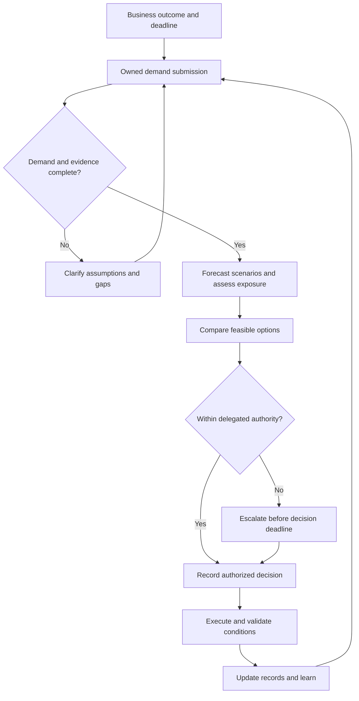

# Get started with CapOps

Start a bounded Capacity Operations (CapOps) practice around real business decisions. The objective is a repeatable path from demand to an authorized action and verified outcome, not an enterprise-wide tool rollout. This guide produces the initial workload profiles, forecast, risk register, responsibility model, and review cycle.

## Prerequisites

- A sponsor willing to resolve priority and authority gaps through existing governance.
- Named business owners and technical contacts for the selected workloads.
- Access to approved inventory, usage, limit, contract, delivery, and continuity information.
- A shared location for versioned records and an agreed policy for confidential evidence.

Choose a manageable scope based on business consequence and dependencies, not a universal number of workloads or staffing ratio.

## Steps and evidence

1. **Agree the mandate.** State which business milestones or recovery objectives the practice supports, its boundaries, sponsor, lead, and escalation path. Complete the [responsibility matrix](../templates/responsibility-matrix.md); keep demand and business-risk decisions with workload owners.
2. **Select workload scope.** Include capacity-sensitive services and their shared dependencies. Complete a [workload profile](../templates/workload-capacity-profile.md) with criticality, placement constraints, and distinct normal, peak, and recovery demand.
3. **Translate business demand.** Ask what changes in users, transactions, data, or delivery commitments. Record the sizing model, quantity and unit, service, family, location, required date, ramp, duration, alternatives, and uncertainty in a [demand submission](../templates/capacity-demand-template.md).
4. **Establish evidence.** Link each supply-posture claim to its source, collection date, exact scope, conditions, and refresh trigger. Keep forecast, quota, financial obligation, capacity mechanism, allocation, and deployment evidence separate.
5. **Build the initial forecast and risk view.** Define local near-, medium-, and long-term horizons. Reconcile baseline, new demand, retirements, and scenario overlap. Register material gaps with options and their last responsible decision deadlines.
6. **Choose actions in existing forums.** Make a decision pack for the appropriate business, technical, commercial, or release authority. Options may include acquisition, alternate placement, staged demand, modernization, or authorized risk acceptance.
7. **Implement and verify.** Record who executes each decision, its due date, acceptance evidence, and rollback or release conditions. Update commitments, allocations, and risks after checking the result.
8. **Create the feedback loop.** Establish a monthly decision review, continuous change triggers, and links to strategic and recovery reviews. Baseline the thirteen maturity dimensions and choose the next improvement based on consequential gaps.

## Demand-to-decision workflow

The business outcome becomes an owned technical demand submission. Incomplete evidence returns for clarification, while urgent gaps are explicitly escalated rather than waiting silently. Complete submissions enter scenario analysis and option comparison. The appropriate authority decides, execution is validated, and outcomes update the next demand cycle. Escalation does not mean approval: the recorded decision can be to hold or change the business plan.

## Worked fictional example

A fictional order service plans a promotion. Its current deployment uses 40 compatible compute units; the peak profile requires 70 in a specified location for two weeks. Recovery needs a separately modeled 50 units in another permitted location.

The owner supplies transaction assumptions. Engineering confirms the sizing test. A quota increase permits requests for 70 units but does not establish the extra 30 units as deployable. The practice records a gap and compares a supported capacity mechanism, a tested alternative family, and a staged promotion. The business owner chooses staging while technical and commercial owners investigate the other options before their deadlines. Recovery remains a separate validation action, not a benefit assumed from the second location. All quantities are illustrative.

## Exit and review criteria

The first cycle is complete when scoped workloads have acknowledged owners, versioned demand and evidence, a forecast, and a risk register; due decisions have authorized outcomes; and implementation actions have evidence-based closure criteria. An unresolved capacity gap does not invalidate the practice, but it must remain visible with an owner and an appropriate business decision.

Revisit after demand or architecture changes, stale evidence, an incident, or the next scheduled decision review. Do not claim deployment readiness merely because the templates are complete.

## Common mistakes

- Buying a tool before agreeing who makes decisions.
- Gathering usage without translating future business demand.
- Calling quota, a financial discount, a service listing, or multiple locations “secured capacity.”
- Excluding shared dependencies or recovery because the pilot is small.
- Waiting for a monthly meeting when an option's latest start date is earlier.

## Related content

- [Operating model](../operating-model/operating-model.md)
- [Build a demand forecast](build-a-demand-forecast.md)
- [Create a capacity-risk register](create-a-capacity-risk-register.md)
- [Conduct a CapOps iteration](conduct-a-capops-iteration.md)
- [Adoption roadmap](../maturity/adoption-roadmap.md)
