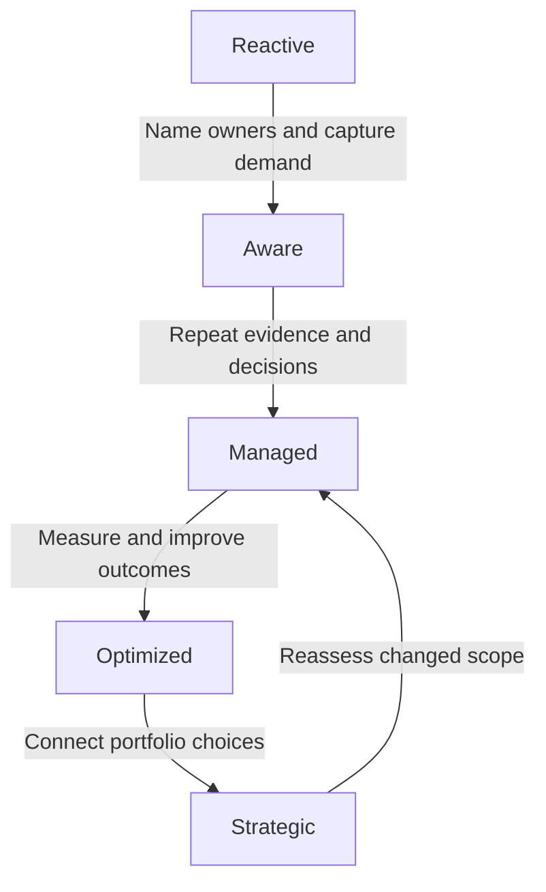

# CapOps maturity model

The Capacity Operations (CapOps) maturity model describes how reliably an organization makes capacity decisions. It is a proposed improvement aid, not a certification, industry benchmark, or promise of capacity availability. Use the [assessment method](assessment.md) to apply the evidence rubric and the [adoption roadmap](adoption-roadmap.md) to choose improvements.

Maturity differs by dimension, workload group, and business unit. A capable forecasting team can coexist with unvalidated recovery arrangements. Assess those differences explicitly.

## Five levels of practice

### 1. Reactive

| Aspect | Observable description |
|---|---|
| Typical behavior | Teams address capacity after a deployment, scaling, or recovery problem. Urgent requests displace planned work. |
| Ownership | An incident responder temporarily owns the issue; demand and commercial accountability are unclear between incidents. |
| Process maturity | Actions are improvised for individual requests, with little reuse of previous findings. |
| Data and tooling | Troubleshooting logs and one-off extracts describe isolated resources; assumptions and observation dates are hard to trace. |
| Decision quality | Teams choose the first workable response without consistently comparing business impact or alternatives. |
| Risk posture | Exposure is discovered late and often accepted implicitly. Recovery dependencies may only become visible during an event. |
| Recommended next step | Name business and technical owners for a bounded workload set; preserve demand, failure evidence, and the next decision deadline in shared records. |

### 2. Aware

| Aspect | Observable description |
|---|---|
| Typical behavior | Teams recognize specific limits and dependencies and discuss future demand, but coverage varies. |
| Ownership | Local champions collect information; handoffs and decision authority are not yet consistent. |
| Process maturity | Initial inventories, forecasts, and reviews exist for selected workloads; exceptions often depend on personal follow-up. |
| Data and tooling | Shared tables or dashboards show some demand and limits, with incomplete freshness or ownership metadata. |
| Decision quality | Some options are compared before a milestone, but permission, economics, and deployability are not always separated in decisions. |
| Risk posture | Risks are visible in pockets; unassessed workloads and recovery scenarios remain explicit gaps. |
| Recommended next step | Establish repeatable evidence requirements, decision rights, and review triggers for the chosen scope, including commitments and recovery. |

### 3. Managed

| Aspect | Observable description |
|---|---|
| Typical behavior | Demand, options, commitments, allocation, and recovery assumptions are reviewed before relevant decisions. |
| Ownership | Business, technical, commercial, and continuity authorities are named; a practice lead stewards shared standards. |
| Process maturity | Versioned forecasts, decision deadlines, checkpoints, expiring exceptions, and action verification operate repeatedly. |
| Data and tooling | Maintained systems of record connect workload demand to evidence, risks, commitments, and decisions. Simple tools are sufficient if reliable. |
| Decision quality | Choices record scope, uncertainty, alternatives, cost, business consequence, and residual risk. |
| Risk posture | Material exposure is explicitly owned and escalated within policy; gaps are not represented as resolved by paperwork. |
| Recommended next step | Use outcomes to improve scenario accuracy, allocation efficiency, evidence freshness, and validation of shared dependencies. |

### 4. Optimized

| Aspect | Observable description |
|---|---|
| Typical behavior | Teams use measured outcomes to refine demand, reclaim or reassign commitments, test alternatives, and challenge recurring constraints. |
| Ownership | Federated owners coordinate shared dependencies through established decision rights and verified handoffs. |
| Process maturity | Feedback loops adjust controls and scenario assumptions; material changes trigger revalidation rather than waiting for a calendar review. |
| Data and tooling | Integrated evidence collection and controlled automation reconcile discrepancies and preserve audit trails and human approval boundaries. |
| Decision quality | Teams compare feasible options and observed outcomes across time, location, resource family, and business value. |
| Risk posture | Dependencies and simultaneous recovery conflicts are tested; residual concentration and mechanism limitations remain visible. |
| Recommended next step | Bring evidence about flexibility, lead time, concentration, and obligations into long-horizon portfolio and investment decisions. |

### 5. Strategic

| Aspect | Observable description |
|---|---|
| Typical behavior | Capacity evidence shapes business sequencing, architecture investment, continuity strategy, and sourcing choices before commitments harden. |
| Ownership | Executives and portfolio authorities use federated evidence to resolve cross-business trade-offs; practice stewardship remains distinct from business authority. |
| Process maturity | Near-, medium-, and long-horizon planning are connected; strategic choices are revisited when assumptions or outcomes change. |
| Data and tooling | Traceable scenario models connect demand, supply mechanisms, economics, dependencies, and realized business outcomes without implying access to provider inventory. |
| Decision quality | Leaders choose among explicit options with sensitivity analysis, reversibility, decision deadlines, and funded alternatives. |
| Risk posture | Residual risk and concentration are consciously managed within business appetite; uncertainty and external constraints are never declared eliminated. |
| Recommended next step | Sustain evidence quality, challenge strategic assumptions, assess new workload groups, and test whether the practice still changes real decisions. |

## Progression is evidence-driven

Progress begins with visible demand and ownership, becomes repeatable decision-making, and then uses outcomes to improve operational and strategic choices. Changed scope can require a new baseline: a strategic practice for one workload group does not automatically qualify a newly acquired business or new resource dependency. The return arrow means reassessment, not a mandatory demotion to a fixed level.

## Evidence rubric: all thirteen dimensions

Each cell describes evidence an assessor can inspect, not a product to buy. Higher levels build on repeatable lower-level controls within the assessed scope. A policy document alone is not evidence that the policy operates.

| Dimension | Reactive | Aware | Managed | Optimized | Strategic |
|---|---|---|---|---|---|
| **Visibility** | Incident records reconstruct resources only after a failure. | A sampled inventory identifies selected workloads and limits, but ownership or freshness gaps are recorded. | A maintained inventory links owners, time, service, family, location, quantity, limits, commitments, and evidence dates. | Reconciliation records show detected drift and corrected source discrepancies with owners. | Portfolio decisions cite scenario-specific exposure and concentration derived from traceable inventory evidence. |
| **Forecasting** | Urgent tickets are the first recorded demand signal. | Teams submit future demand lists with known sizing or date gaps. | Versioned near-, medium-, and long-horizon scenarios link business drivers, ramps, retirements, and owner validation. | Reviews compare forecast scenarios with actuals and document changes to sizing or uncertainty assumptions. | Investment and sequencing decisions cite forecast sensitivities, option lead times, and alternative business scenarios. |
| **Quota management** | Failed requests trigger one-off limit increases. | A limit inventory and selected alerts exist, with acknowledged coverage gaps. | Scoped limits, demand comparisons, request owners, lead times, and outcomes are tracked separately from physical capacity evidence. | Change-triggered checks detect limit drift and request failures; reviews improve triggers from observed results. | Long-horizon platform and portfolio choices account for administrative constraints, approval lead times, and alternative scopes. |
| **Acquisition** | Capacity requests are raised after a delivery blockage. | Selected mechanisms and lead times are cataloged, but terms or business ownership are incomplete. | Acquisition decisions record exact scope, terms, approvals, latest decision date, prerequisites, and validation evidence. | Reviews compare acquisition outcomes and unused obligations against the original assumptions and revise the selection process. | Sourcing and investment decisions compare long-term obligations, architecture flexibility, concentration, and exit options. |
| **Allocation** | Messages or incident actions reassign shared capacity without a maintained ledger. | An allocation list exists for some consumers, with disputed ownership or untracked changes. | A ledger names consumers, quantities, priorities, allowed uses, conflicts, and authorized reassignment or release. | Actual consumption is reconciled with assignments; documented reclaims avoid double allocation and protect recovery use. | Portfolio authorities use scenario-aware allocation evidence to resolve cross-business priorities and funding responsibilities. |
| **Workload placement** | Location or family changes occur during a blocked deployment with limited prior validation. | Preferred and alternate placements are listed, with testing or constraint gaps. | Decisions validate performance, permitted locations, dependencies, costs, and change lead time for selected alternatives. | Exercises and delivery outcomes show usable alternatives; placement patterns are revised when equivalence assumptions fail. | Architecture investments preserve deliberate options across future business scenarios, evidenced by portfolio decisions. |
| **Governance** | Retrospective approvals document decisions already taken during emergencies. | Draft rules and occasional reviews exist, but application varies across sampled changes. | Existing checkpoints use defined evidence and authority; exceptions have owners, expiry, and follow-up records. | Reviews show controls changed in response to bypasses, delays, incidents, and failed assumptions. | Governance changes are tied to business risk appetite and investment strategy, with evidence of continued delegated authority. |
| **Optimization** | A local cleanup happens after a cost or capacity incident without a recorded baseline. | Teams list idle allocations or legacy dependencies but do not consistently execute actions. | Reviewed actions reclaim, reassign, rightsize, or modernize with baseline, approval, and outcome evidence. | Repeated measurement demonstrates whether changes improved utilization or flexibility without breaching workload needs. | Modernization and investment decisions evaluate portfolio options, lifecycle obligations, and business outcomes together. |
| **Resilience** | Incident or exercise records first expose destination capacity assumptions. | Recovery destinations and objectives are listed, with unvalidated quantities or shared dependencies identified. | Separate normal, peak, and recovery profiles have scoped validation evidence and owned residual gaps. | Concurrent portfolio recovery exercises include resident load, rebuild overhead, contention, and restoration order; findings are retested. | Business continuity investment and service objectives change in response to portfolio scenario results and concentration exposure. |
| **Risk management** | Issues are tracked only after a milestone is missed or deployment fails. | A risk list records selected impacts but has missing decision dates or acceptors. | Risk records link events, impact, evidence freshness, options, deadlines, mitigations, acceptance, and closure tests. | Reviews validate mitigation effectiveness and use near misses to adjust exposure and action lead times. | Portfolio choices explicitly weigh residual risk, business value, reversibility, and long-term dependencies. |
| **Reporting** | Isolated incident summaries or utilization screenshots drive discussion. | Recurring dashboards exist but known denominator, scope, or freshness gaps limit decisions. | Operational and executive views link organization-defined measures to owners, evidence, decisions, and deadlines. | Reviews retire misleading measures and document actions and outcomes driven by retained measures. | Leaders use scenario-sensitive reporting for investments and priorities and check whether decisions achieved intended outcomes. |
| **Automation** | Emergency scripts run with manual interpretation and weak traceability. | Selected repeatable scripts exist, with documented manual checks and remaining control gaps. | Tested automation has defined inputs, validation, access boundaries, approval points, failure handling, and audit records. | Controlled integrations reconcile records, detect stale evidence, and demonstrate safe recovery from automation failures. | Investment decisions govern automation by business risk and value; scenario analysis remains explainable and material decisions retain authorized oversight. |
| **Organizational ownership** | Incident responders temporarily take charge and unresolved handoffs appear in reviews. | Local champions and some workload owners are named, but authority gaps are recorded. | Sponsor, practice steward, and federated decision owners have named responsibilities, deputies, and observed handoffs. | Cross-team reviews show conflicts resolved through those rights and ownership corrected after changes. | Executive and portfolio decisions consistently use federated evidence while domain authorities retain technical, commercial, and business accountability. |

## Interpret results without hiding weakness

Record the highest level sustained by current, representative evidence for each dimension and business scope. If evidence is missing or inaccessible, mark **not assessed** or **insufficient evidence** rather than guessing Reactive or granting a high score. Record contradictory evidence and any scope exclusions.

Do not calculate an average maturity score to represent readiness. A critical service with Managed forecasting and Reactive resilience still has a critical recovery weakness. Identify critical dimensions before assessment, report their gaps separately, and require an explicit decision on unresolved exposure. Locally chosen targets need a business rationale; Strategic is not an automatic objective for every team.

Common mistakes are scoring the existence of a dashboard rather than its use, equating automation volume with control quality, comparing unlike business units, and treating higher maturity as capacity assurance.

## Related content

- [Assessment method](assessment.md)
- [Maturity assessment template](../templates/maturity-assessment.md)
- [Adoption roadmap](adoption-roadmap.md)
- [Operating model](../operating-model/operating-model.md)
