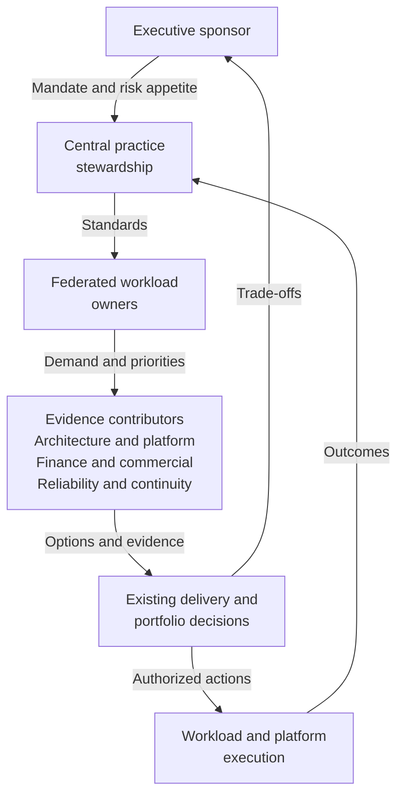

# CapOps operating model

Capacity Operations (CapOps) is a proposed operating discipline, not a new approval hierarchy. Its operating model connects business demand to evidence about deployment, scaling, and recovery. This page explains how the practice works across teams; the [responsibility model](roles-and-responsibilities.md) assigns decision rights and the [cadence](operating-cadence.md) defines when decisions are made.

## Central standards, federated business authority

An executive sponsor establishes scope, risk appetite, escalation authority, and access to existing investment and portfolio decisions. A practice lead maintains shared definitions, evidence requirements, coaching, and the cross-workload view. Neither substitutes for the accountable business owner.

Workload owners remain accountable for demand accuracy, priority, dates, and accepted business consequences within delegated authority. Architecture owns the technical suitability of alternatives. Platform teams operate acquisition and allocation mechanisms. Commercial authorities approve contractual obligations. Reliability and continuity owners validate operational and recovery evidence. A small organization may combine roles, but must still make these different decisions explicit.

The sponsor gives the practice its mandate. The practice provides standards rather than taking over workload decisions. Business, engineering, finance, and continuity evidence meet in existing decision forums; authorized teams execute the choices. Outcomes return to the practice, while trade-offs beyond delegated authority return to the sponsor or established portfolio authority.

## The minimum operating system

| Component | How it operates | Persistent output and owner |
|---|---|---|
| Demand intake | Translate a business outcome into service, resource family, quantity and unit, permitted location, required date, ramp, duration, and flexibility. Return incomplete submissions before making a capacity claim. | Versioned demand submission; business owner |
| Rolling forecast | Compare measured baseline with launches, growth, peaks, recovery scenarios, and confirmed retirements across locally defined near, medium, and long horizons. | Scenario forecast with assumptions and freshness; workload owners validate their slices |
| Risk register | Describe an uncertain event and business consequence, identify options, and calculate the last responsible decision deadline from required date and action lead time. | Risk record with decision owner and next evidence check |
| Checkpoints | Reuse architecture, investment, delivery, launch, migration, and continuity controls. Confirm that evidence still fits the current demand, rather than accepting a historic approval. | Proceed, change, hold, or expiring exception decision |
| Commitments and allocation | Evaluate, acquire, assign, consume, review, and release or renew under the mechanism's terms. Keep contractual obligation, deployable entitlement, and actual consumption separate. | Commitment register and allocation ledger; named commercial and technical owners |
| Operational reporting | Show dimension-specific gaps, failed deployments, quota headroom, unassigned or idle commitments, recovery conflicts, stale evidence, and approaching decisions. | Actionable team view with evidence owners |
| Executive reporting | Summarize business milestones exposed, competing priorities, residual risk, options, funding implications, and decisions beyond team authority. | Decision brief linked to operational evidence |
| Exceptions and learning | Time-limit deviations, name the risk acceptor, and revisit after expiry, a material change, or an incident. | Exception record, verified corrective actions, and revised standards |

“Secured” describes only a documented posture under stated conditions. Planning, quota, supported capacity mechanisms, architecture flexibility, and provider engagement may all contribute, but none should be relabeled an unconditional guarantee. A forecast, financial discount, service-catalog listing, multiple regions, or recovery design does not establish deployable capacity.

## Six integration points

Use existing responsibilities and forums. The integration is the shared evidence and decision, not a requirement to create six new meetings.

| Discipline | Information exchanged | Joint decision |
|---|---|---|
| FinOps, the technology financial-management practice | Demand scenarios, allocation, consumption, unused obligations, and option costs | Whether an affordable option also meets the deployment need; who funds idle or shared commitments |
| Enterprise architecture | Approved patterns, performance equivalence, location constraints, and migration effort | Which alternatives are technically and legally usable before a decision deadline |
| Reliability and operations | Saturation, failed deployment signals, dependencies, incident evidence, and safe change windows | Whether to rebalance, scale, constrain demand, or invoke an operational response |
| Business continuity | Recovery objectives, failure scenarios, restoration order, destination demand, and test results | Whether the portfolio recovery plan can operate with concurrent demand and shared dependencies |
| Procurement and commercial management | Current mechanism scope, lead time, cancellation rules, obligations, and renewal dates | Whether to acquire, amend, renew, or release an obligation within approval authority |
| Portfolio planning | Business value, delivery milestones, aggregate demand, retirements, and competing priorities | Which workloads to sequence, defer, modernize, or fund when feasible capacity is constrained |

## Evidence moves with the decision

Every material conclusion links to its source, collection date, exact scope, validity assumptions, and next refresh trigger. A successful deployment establishes evidence for that deployment at that time; it does not expose a provider's inventory or prove future availability. Unknown or stale evidence is visible as a gap, not silently treated as “green.”

For example, a fictional launch team may prefer an inflexible resource family. The lead assembles the conflict; the architect evaluates another family; the commercial owner prices a supported mechanism; the business owner chooses a phased launch or accepts authorized residual risk. The lead does not approve the spend, certify performance, and accept the delivery risk on everyone's behalf.

## Keep the model proportionate

Start with capacity-sensitive workloads and expand according to evidence of business exposure. Reuse existing systems of record, but preserve links among demand, risk, commitment, allocation, and decision identifiers. Do not measure practice success by meeting count, forecast volume, or the number of reservations acquired. Review whether decisions occur while viable options remain, whether assumptions are tested, and whether assigned actions are closed with evidence.

## Related content

- [Roles and responsibilities](roles-and-responsibilities.md)
- [Governance](governance.md)
- [Operating cadence](operating-cadence.md)
- [Capacity review](capacity-review.md)
- [Get started with CapOps](../implementation/getting-started.md)
- [Responsibility matrix template](../templates/responsibility-matrix.md)
