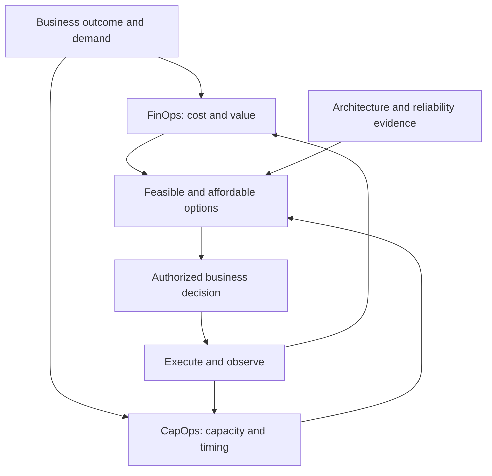

# CapOps and FinOps

This page explains how Capacity Operations (CapOps) and FinOps contribute to the same business decisions without conflating financial optimization with deployable capacity.

FinOps asks, “Can we afford it?”

CapOps asks, “Can we get it where and when we need it?”

Organizations need to answer **both** questions. This comparison is introductory shorthand, not a full definition of FinOps. FinOps also concerns technology value, collaboration, usage, and financial accountability; CapOps focuses attention on capacity requirements, deployability, allocation, and recovery readiness.

| FinOps perspective | CapOps perspective |
|---|---|
| Cost, usage, and value expectations | Time-bound demand by technical shape and placement |
| Budget, unit economics, and financial risk | Deployment, scale, and recovery exposure |
| Commercial rates and commitment economics | Supported capacity mechanisms and their scope |
| Financial attribution and accountability | Allocation, consumption, and release ownership |
| Economic assessment of alternatives | Technical feasibility and time needed to switch |

## A joint decision, not competing approvals

The relationship below starts with one business requirement. Financial analysis and capacity analysis inform a joint set of options; the authorized decision owner chooses a trade-off, and observed results update both views.

Neither analysis is a veto by default. Local decision rights determine who may accept a cost increase, change a date, reduce scope, or accept capacity exposure. An unaffordable but technically feasible option and an inexpensive but unavailable option both require another decision.

## Working together

1. **Use the same demand version.** Align workload identifiers, forecast dates, demand ranges, and decommissioning assumptions. A forecast in currency alone is insufficient for capacity matching.
2. **Separate financial and technical claims.** Record any discount commitment independently from the mechanism intended to support deployment. A product may support one, both, or neither outcome; verify its definition in current public provider guidance.
3. **Price the complete alternative.** Include idle capacity, migration work, licenses, data movement, testing, and operational complexity where relevant. State uncertain costs rather than silently omitting them.
4. **Make priorities explicit.** Business owners explain why a deadline or recovery objective matters. Architects and engineers establish whether a cheaper family, location, or schedule is acceptable.
5. **Review the lifecycle together.** Revisit utilization, forecast changes, release or expiry, and commitment mismatch. A workload move does not necessarily move a commercial obligation.

## Illustrative decision

A fictional analytics product has flexible batch work and a fixed-date customer launch. The team compares scheduling batch jobs later, acquiring a supported capacity mechanism for launch demand, and qualifying an alternative family. FinOps evaluates the economic exposure of each path; CapOps assembles technical matching, lead-time, and residual-risk evidence. The product owner decides the release scope, while the authorized commercial approver decides any purchase.

The record preserves separate conclusions: the budget is approved, the chosen capacity mechanism covers specified demand under stated conditions, and uncovered growth remains an owned risk.

## Risks and common mistakes

- Treating a financial reservation or commitment discount as a capacity reservation.
- Optimizing idle recovery resources away without the continuity owner's agreement.
- Holding unnecessary capacity solely to make a coverage metric look favorable.
- Comparing options using incompatible forecast versions or omitting the cost of switching.
- Assuming CapOps replaces existing FinOps responsibilities or is an endorsed extension of another framework.

## Related content

- [What is CapOps?](what-is-capops.md)
- [Capacity acquisition](../capabilities/capacity-acquisition.md)
- [Capacity optimization](../capabilities/capacity-optimization.md)
- [Capacity allocation](../capabilities/capacity-allocation.md)
- [Workload placement](../capabilities/workload-placement.md)
